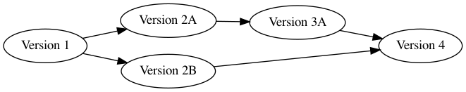

# git-workshop
A living tutorial to discover the magical wonders of git.
  

---

# Why git?

git is a simple but highly flexible system for keeping track of stuff on one or more computers. But, everyone probably already has some way of doing the same thing. Why should I spend my time learning git?
 

## How do you keep track of your changing files and documents?

If you're like most academics, you've probably got some version of this extremely versatile naming convention:

1. analysis.R
2. analysis_new.R
3. better_analysis_new.R
4. better_analysis_new_FINAL.R
5. better_analysis_new_FINAL_for_real.R
6. better_analysis_new_FINAL_for_real_for_real.R
7. F*$%^!HF@#KAJVRSAWEOH!#LD.R
8. ...

If you're working with a folder with multiple files changing inside, you probably do the same kind of thing: duplicate the folder and make some changes to some files.

Now, this might be all you need if you've got a fantastic memory. But have you ever come back to one of these sorts of projects after a month, or a year of not looking at it? If so, you probably know that it's basically impossible to tell what the differences between the files are, why they're all different, and which file is *really* the final version.

Thankfully, some programmers got sick of doing this, and they've made a tool to make everyone's lives just that much easier. It's called **git**.
 

## What does git *do*?
You can think of git as letting you set "save points" for your files, just like you hit save points in video games. Once you hit a save point, you can always go back to that version of your files at any time in the future.

To do this, git will put in a (hidden) folder named `.git` inside your project folder. This `.git` folder keeps a list of all of the save points you've hit in the past. Specifically, it keeps track of which files change and what changes are made between save points. You'll end up with something like the graph below of save-points, where every version is made by changing some previous version. So if you start with a version 1, make some changes for version 2A, make some more changes for version 3A, make some different changes to version 1 for version 2B, and merge together version 3A and version 2B into version 4, git will store this graph:

As you can see, this is pretty useful: your older versions are always there for you to look back on, you can "branch" off into different directions from any version, and you can "merge" different branches with different sets of changes back into a final version.
 

## What if I'm working with other people, or on multiple computers?
This is where [GitHub](https://github.com) comes in. It's a place where you can put your files online, so that anyone (with access) can download your files, make changes to them, and upload the new version for others.
 
 

---

# Terminology

Before we get into the details of using git, let's set up some standard terminology:

| Jargon | Definition |
| :---: | --- |
| Repository | the folder that holds all of your files, as well as a `.git` sub-folder |
| Commit (noun) | a "save-point" that freezes on version of your repository |
| Commit (verb) | to create a new commit local to your computer |
| Branch (noun) | a sequential chain of commits that has a name (e.g., "master") |
| Branch (verb) | to create a new branch |
| Clone | to download a repository from the internet (e.g., GitHub) to your computer |
| Checkout | to switch to a commit (or, open a save-point) |
| Fetch  | to update your `.git` folder with changes made online  |
| Pull  | to apply new commits to your old repository- like "Fetch" but also applies new changes |
| Push  | to update the online repository with your new commits  |
| Merge | to mix together two sets of changes from two different branches |
 

---
# Setup

## Installation

| Windows | Mac OSX | Linux (Ubuntu) |
| ------- | ------- | -------------- |
| 1. [Follow these instructions!](https://gitforwindows.org/) | 1. Install [HomeBrew](https://brew.sh/)   2. Open a terminal   3. Type in `brew install git` and press `Enter` | 1. Open a terminal   2. Type in `sudo apt-get install git` and press `Enter` |
 

In this tutorial, we will focus on using git within the terminal (I promise, you'll get the hang of it!). If you prefer to use an app (like [GitHub Desktop](https://desktop.github.com/) or [SourceTree](https://www.sourcetreeapp.com/)) with a graphical user interface (GUI) to use git, then feel free to do so. But in my experience, it's worth putting in the effort to learn the terminal commands because 1.) you won't have to deal with bugs, error messages, and intricate displays to which these apps are prone, and 2.) sometimes (like when working on a remote server or on a different operating system), you won't be able to use the app anyway.

## GitHub registration
Much of the time, you want to be able to share your files (code, documentation, etc) with collaborators, reviewers, readers, or even the rest of the world. GitHub is a great place to do that! In this organization, all of our workshop materials (demos, tutorials, blogs, slides) will be hosted on GitHub so that anyone can access these materials online at any point in the future. In order to make this happen, you will need to:

1. Sign up for a GitHub account [here](https://github.com/join)
2. Join the [DukeNeuroMethods Organization](https://github.com/DukeNeuroMethods)!
 

## And that's it!
---

# Make a repository
To take full reign of the capabilities that git has to offer, you need to make a git repository for your project. There are two ways to do this, depending on whether you want your repository to exist only on your computer or whether you want it to be hosted online through GitHub.
 

### Option 1: keep it local
If you're the only one that's going to do anything with your repository, or if the repository contains private information that you don't want to share with others, then it might make sense to keep the repository local to your computer. In this case, the process for creating a new repository or turning an existing folder into a git repository is easy peasy:

1. Open up a terminal and navigate (using `cd`) to your project folder
2. Type in the command `git init` and press `Enter`

Congrats! You've now turned an ordinary folder into a git repository. You should now see that the folder has a sub-folder called `.git`, which is how you know that this folder is now a git repository.
 

### Option 2: code in the cloud
If you're going to be working on multiple computers, have multiple collaborators on your project, or simply want an online backup of your repository, then you probably want to put your repository on GitHub:

1. Open your browser and navigate to https://github.com/new.
2. Enter in the details for your repository. Specifically, you can enter these things:
   - Repository name (what you will call your repository)
   - Description (a quick summary of what's in the repository)
   - Privacy (public repositories can be seen by anyone, but private repositories can only be seen by collaborators)
   - `README` file (a file that has a lengthier description of the repository)
   - `.gitignore` file (a file that tells git which files to ignore)
   - License (a file that specifies how others can use your files)
3. Click on the `Create repository` button
4. Navigate to the repository in your browser (you may be automatically redirected there)
5. Click on `Code` and copy the link under `Clone with HTTPS`
6. Open a terminal and navigate to wherever you want your repository to go on your computer
7. Type in the command `git clone <repository-link>` and press `Enter`

Congrats! You have now made a repository through GitHub and *cloned* (downloaded) it onto your computer! If the repository already exists on GitHub and you just need to clone it onto a new computer, you can start from Step 4 above.
 

> ### Exercise 1: clone [this repository](https://github.com/DukeNeuroMethods/git-workshop)!
> You may have noticed that this very web-page is located on GitHub within a GitHub repository. To help get some practice using git and GitHub, we're going to all collaboratively edit this document together. To do this, you first need to *clone* this repository, which exists online on GitHub, into a copy that exists on your computer. Thankfully, this looks exactly like steps 4-7 above:
>
> 4. Navigate to [the repository](https://github.com/DukeNeuroMethods/git-workshop) in your browser (you may be automatically redirected there)
> 5. Click on `Code` and copy the link under `Clone with HTTPS`
> 6. Open a terminal and navigate to wherever you want the repository to go on your computer
> 7. Type in the command `git clone https://github.com/DukeNeuroMethods/git-workshop.git` and press `Enter`
>
> Congrats! You have cloned this repository on your computer. You should now have a folder with the same name as this repository (`git-workshop`). Inside that folder, you will see a copy of this file (`README.md`), a license file (`LICENSE`), a `.git` folder, and some other stuff.
 

---

# Make some changes
The magic of git doesn't really kick in until your files start changing. In practice, here is when you would add and edit some code, write up some documentation, or put some other kinds of files into your repository. For the purposes of this tutorial, we're going to ask you to edit this document (`README.md`):
 

> ### Exercise 2: edit this tutorial
>
> The [very last section of this document](#declaration) has a list of all of the highly esteemed individuals who have completed this tutorial. You might notice that something is missing here- **your name!** To make sure that everyone knows how skilled and accomplished you are, you need to add yourself to this list. So, here's what we need to do:
>
> 1. Open up the file `README.md` in your favorite text editor
> 2. Scroll to the very end (the section entitled *Declaration of Git Wizardy*)
> 3. Add a new line at the end, and type in `- <First Name> <Last Name>`
>
> Congrats! Now everyone that opens this file on your computer knows that you are a git wizard.

---

# Commit your changes

Now that we've made some changes to our repository, we need to make a *commit*, which is like a "save-point" for our repository. This commit will allow us to recover this version of the repository at any point in the future, even if you have made further changes to these files, or even if you have deleted them completely. As long as your `.git` subfolder is still there, you can go back to this previous commit.

> ### Exercise 3: stage your changes
> To make a new commit, we first have to tell git which changes we want to "save" and which ones we're not ready to keep yet. In git-lingo, this process is called *staging*- your *staged* changes will be added to the next commit, and your *unstaged* changes will be invisible to that commit.
>
> 1. Open up a terminal and navigate to your local repository
> 2. Type in the command `git status` to see what changes have been made from the last commit. You should see that this file (`README.md`) has been modified, but is not yet staged for the next commit.
> 3. Type i the command `git add README.md`. This will stage `README.md` for the next commit. If you have a bunch of changed files, you can use the command `git add --all` to add all of them. Finally, if you only want to stage some of the changes within a given file, you can use `git add --patch <filename>` to select the only parts that you want to stage.
> 4. Again, type in the command `git status` to make sure that all of (and only) the changes you want to stage are staged.
>     - If you accidentally staged some changes that you don't want staged, you can enter the command `git reset HEAD <filename>`. This will unstage the file, but keep the changes on your computer.

 

What just happened? By using `git add`, we've told git that we want to "save" the change we just made. Specifically, we told git that in our next commit, your name will listed at the end of `README.md`. But, we haven't yet done the "saving" part- we still need to commit our changes.
 

> ### Exercise 4: commit your changes
> Now that we've told git which changes we want to commit and which changes we want to hold out, we can commit our staged changes!
> 1. Open up a terminal and navigate to your local repository
> 2. Type in the command `git status` and press `Enter`. You'll again see all of your staged changes, but this time note that at the top it says something like `On branch master. Your branch is up to date with 'origin/master'`. This lets you know that you don't have any committed changes that aren't also on GitHub.
> 3. Type in the command `git commit -m "<commit-message>"` and press `Enter`. The `<commit-message>` is some description of the changes you are committing, so that if you come back to it later you can remember what you've done. If you don't feel like typing this all out in the terminal, you can just type `git commit` by itself, and git will open up a text editor for you to type the message in.
> 4. Once again, type in `git status` and press `Enter`. This time, you should see that there are no staged or unstaged changes, and at the top it should say something like `On branch master. Your branch is ahead of 'origin/master' by 1 commit`. This lets you know that you have successfully committed your changes and that your committed changes are only visible on your local computer, but not on GitHub.
> 5. If you prefer a graphical way of seeing your commit (and other previous commits), you can use the command `git log --all --decorate --oneline --graph`. This will print a pretty graph (like the one at the beginning of this tutorial) that shows all previous commits in the order that they were made. If you can't remember all of those command-line arguments, `git log` by itself will show you a less-pretty list of previous commits.

---

# Switch between commits

---

# Push your changes

As you saw with your last `git status`, even though you

---

# Declaration of Git Wizardy {#declaration}
We, the undersigned, hereby authorize ourselves as official git wizards:

- Kevin O'Neill
- (insert your name here!)
