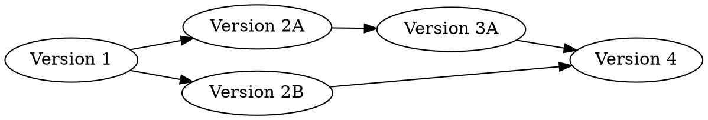

# git-workshop
An exploratory sandbox to discover the magical wonders of git.

---

# Why git?

git is a simple but highly flexible system for keeping track of stuff on one or more computers. But, everyone probably already has some way of doing the same thing. Why should I spend my time learning git?

## How do you keep track of your changing files and documents?

If you're like most academics, you've probably got some version of this extremely versatile naming convention:

1. analysis.R
2. analysis_new.R
3. better_analysis_new.R
4. better_analysis_new_FINAL.R
5. better_analysis_new_FINAL_for_real.R
6. better_analysis_new_FINAL_for_real_for_real.R
7. F*$%^!HF@#KAJVRSAWEOH!#LD.R
8. ...

If you're working with a folder with multiple files changing inside, you probably do the same kind of thing: duplicate the folder and make some changes to some files.

Now, this might be all you need if you've got a fantastic memory. But have you ever come back to one of these sorts of projects after a month, or a year of not looking at it? If so, you probably know that it's basically impossible to tell what the differences between the files are, why they're all different, and which file is *really* the final version.

Thankfully, some programmers got sick of doing this, and they've made a tool to make everyone's lives just that much easier. It's called **git**.

## What does git *do*?
You can think of git as letting you set "save points" for your files, just like you hit save points in video games. Once you hit a save point, you can always go back to that version of your files at any time in the future.

To do this, git will put in a (hidden) folder named `.git` inside your project folder. This `.git` folder keeps a list of all of the save points you've hit in the past. Specifically, it keeps track of which files change and what changes are made between save points. You'll end up with something like the graph below of save-points, where every version is made by changing some previous version. So if you start with a version 1, make some changes for version 2A, make some more changes for version 3A, make some different changes to version 1 for version 2B, and merge together version 3A and version 2B into version 4, git will store this graph:

